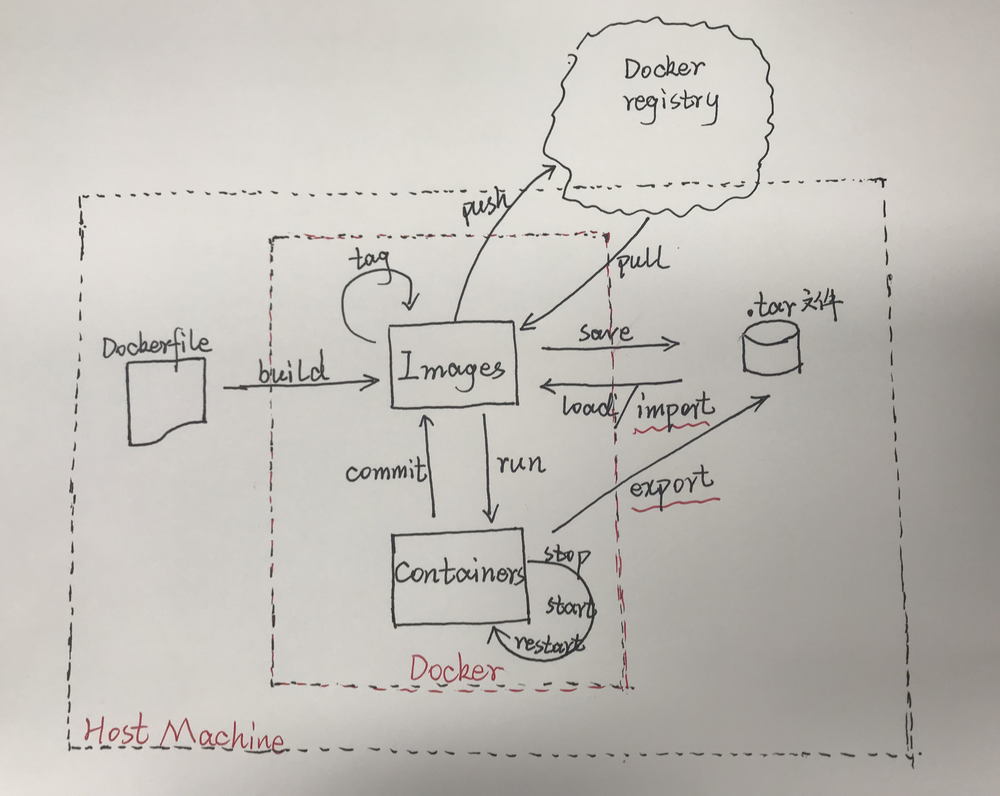

### Docker 使用笔记
---
[Docker 常见问题](./Docker%20%E5%B8%B8%E8%A7%81%E9%97%AE%E9%A2%98.md)
1. [关于 Docker](./Docker%20%E5%B8%B8%E8%A7%81%E9%97%AE%E9%A2%98.md)
2. [本地的镜像文件都存放在哪里？](./Docker%20%E5%B8%B8%E8%A7%81%E9%97%AE%E9%A2%98.md#本地的镜像文件都存放在哪里)
3. [一些参数的全称](./Docker%20%E5%B8%B8%E8%A7%81%E9%97%AE%E9%A2%98.md#一些参数的全称)

[镜像](./%E7%AC%AC3%E7%AB%A0%20%E9%95%9C%E5%83%8F.md)
1. [获取镜像](./%E7%AC%AC3%E7%AB%A0%20%E9%95%9C%E5%83%8F.md)
2. [查看镜像信息](./%E7%AC%AC3%E7%AB%A0%20%E9%95%9C%E5%83%8F.md#32-查看镜像信息)
3. [搜寻镜像](./%E7%AC%AC3%E7%AB%A0%20%E9%95%9C%E5%83%8F.md#33-搜寻镜像)
4. [删除镜像和清理镜像](./%E7%AC%AC3%E7%AB%A0%20%E9%95%9C%E5%83%8F.md#34-删除镜像和清理镜像)
5. [创建镜像 或者 构建镜像](./%E7%AC%AC3%E7%AB%A0%20%E9%95%9C%E5%83%8F.md#35-创建镜像-或者-构建镜像)
6. [存出镜像（导出镜像）和 载入镜像（导入镜像）](./%E7%AC%AC3%E7%AB%A0%20%E9%95%9C%E5%83%8F.md#36-存出镜像导出镜像和-载入镜像导入镜像)
7. [上传镜像](./%E7%AC%AC3%E7%AB%A0%20%E9%95%9C%E5%83%8F.md#37-上传镜像)

[容器](./%E7%AC%AC4%E7%AB%A0%20%E5%AE%B9%E5%99%A8.md)
1. [创建容器](./%E7%AC%AC4%E7%AB%A0%20%E5%AE%B9%E5%99%A8.md)
2. [进入容器](./%E7%AC%AC4%E7%AB%A0%20%E5%AE%B9%E5%99%A8.md#42-进入容器)
3. [退出容器](./%E7%AC%AC4%E7%AB%A0%20%E5%AE%B9%E5%99%A8.md#43-退出容器)
4. [终止容器](./%E7%AC%AC4%E7%AB%A0%20%E5%AE%B9%E5%99%A8.md#44-终止容器)
5. [导出容器](./%E7%AC%AC4%E7%AB%A0%20%E5%AE%B9%E5%99%A8.md#45-导出容器)
6. [从宿主机拷贝文件到容器](./%E7%AC%AC4%E7%AB%A0%20%E5%AE%B9%E5%99%A8.md#46-从宿主机拷贝文件到容器)

[数据卷](./%E7%AC%AC6%E7%AB%A0%20Docker%20%E6%95%B0%E6%8D%AE%E7%AE%A1%E7%90%86.md)

[使用 Dockerfile 快速构建镜像](./%E7%AC%AC8%E7%AB%A0%20%E4%BD%BF%E7%94%A8%20Dockerfile%20%E5%88%9B%E5%BB%BA%E9%95%9C%E5%83%8F.md#从一个简单的-dockfile-开始创建一个镜像并启动容器)

[Docker 三剑客 Docker-Compose](./Docker%20%E4%B8%89%E5%89%91%E5%AE%A2%20Compose.md)

### 【注】Docker 命令结构图

